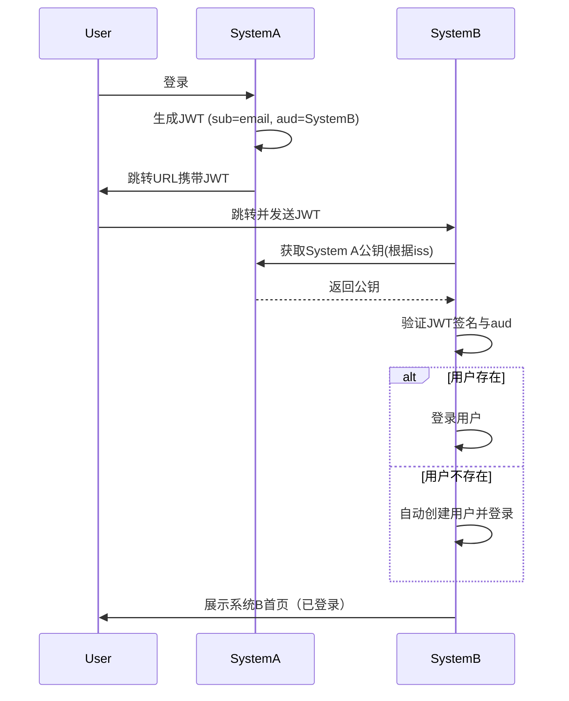

# Trusta Spring Boot Starter

Trusta 是一种去中心化的联邦身份认证方案，允许多个系统的存在共享用户标识符（例如统一用户 ID、电子邮箱等）时，通过简单配置实现用户认证状态的共享。

## 功能特点

- JWT（使用 ECDSA + SHA256）签名与验证
- 联邦身份认证
- 可信发行方管理
- Spring Boot 自动配置



## HowTo

在 `pom.xml` 中添加如下依赖：

```xml
<dependency>
    <groupId>cc.ddrpa.dorian</groupId>
    <artifactId>trusta-spring-boot-starter</artifactId>
    <version>0.0.1</version>
</dependency>
```

在 `application.yml` 中配置可信发行方和 JWT 属性，下方是一个典型的示例：

```yaml
trusta:
  private-keyset-file: '.jwt-es256-private-keyset'
  issuer: 'yufanonsoftware.example.cc'
  allow-http: true
  trusted-issuers:
    - issuer: 'ddrpa.example.cc'
      expect-audience: true
      claim-mapping:
        iss: 'from'
    - issuer: '192.168.22.100'
      public-key-uri: 'http://192.168.22.100:8084/hello/.well-known/trusta/jwks.json'
      expect-audience: false
      subject: 'email'
```

**发生了什么？**

在这个例子中：

- 程序使用 `.jwt-es256-private-keyset` 文件中的私钥进行 JWT 的签名，若文件不存在，系统将在启动时生成
- 本系统签发的密钥，其 `issuer` 为 `yufanonsoftware.example.cc`，与程序域名相同
  - 程序暴露 `/.well-known/trusta/jwks.json` 端口，通过该端口可以获取用于验证 token 的公钥
  - 通过 NGINX 等反向代理服务器，可以将该端口暴露为 `https://yufanonsoftware.example.cc/.well-known/trusta/jwks.json`


- 程序同时声明了接收两个可信发行方的 JWT：
  - **ddrpa.example.cc**
    - 从 `https://ddrpa.example.cc/.well-known/trusta/jwks.json` 获取公钥
    - 需要验证 `aud` 声明
    - 提取 JWT 中的 `sub` 字段作为 Subject 标识
    - 提取 `iss` 字段映射为 `from` 属性。
  - **192.168.22.100**
    - 从 `http://192.168.22.100:8084/hello/.well-known/trusta/jwks.json` 获取公钥 
    - 不需要验证 `aud` 声明
    - 提取 JWT 中的 `email` 字段作为 Subject 标识

符合上述配置的 JWT 可以被验证和解析，以便系统建立有效的用户认证状态。

````java
VerifiedClaims verifiedClaims = trustaManager.verify(token);
assertEquals("tom@outlook.com", verifiedClaims.getSubject());
````

上述验证通过后，系统可为相应用户创建认证状态，或者当用户不存在时，自动创建用户并登录。
