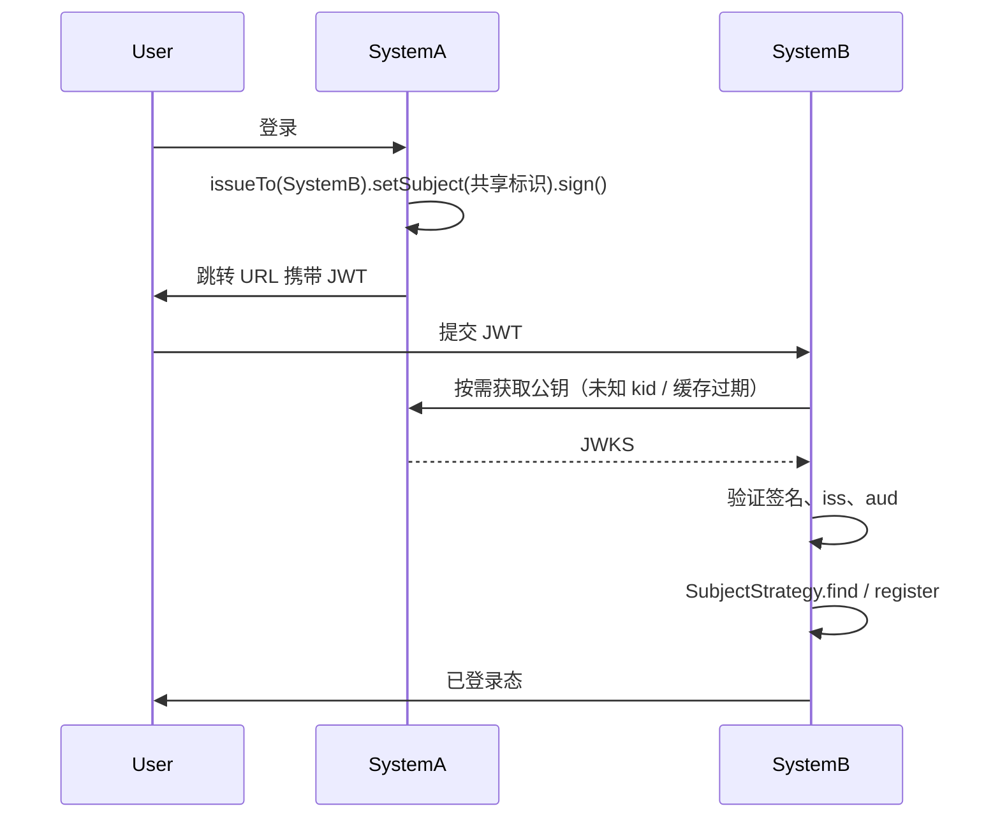

# Trusta Spring Boot Starter

Trusta 是一种去中心化的联邦身份认证方案：签发方必须明确知道签发给谁；接收方主动声明信任哪些签发方，并用策略把 JWT `sub` 匹配到本地用户。

## 功能特点

- JWT（ECDSA + SHA256）签名与验证，header 携带 `kid`
- 签发必须指定 `audience`，无通配符
- 接收方始终校验 `iss` / `aud`，subject 固定为 `sub`
- 按签发方绑定 `SubjectStrategy`（可多 issuer 复用同一 Class）
- 签发方 keyset 轮换；接收方按 `kid` 缓存公钥，未知 `kid` 时再拉取


```mermaid
sequenceDiagram
    participant User
    participant SystemA
    participant SystemB

    User->>SystemA: 登录
    SystemA->>SystemA: issueTo(SystemB).setSubject(共享标识).sign()
    SystemA->>User: 跳转 URL 携带 JWT
    User->>SystemB: 提交 JWT
    SystemB->>SystemA: 按需获取公钥（未知 kid / 缓存过期）
    SystemA-->>SystemB: JWKS
    SystemB->>SystemB: 验证签名、iss、aud
    SystemB->>SystemB: SubjectStrategy.find / register
    SystemB->>User: 已登录态
```

## HowTo

在 `pom.xml` 中添加依赖：

```xml
<dependency>
    <groupId>cc.ddrpa.dorian</groupId>
    <artifactId>trusta-spring-boot-starter</artifactId>
    <version>0.0.1</version>
</dependency>
```

### 配置

```yaml
trusta:
  private-keyset-file: '.jwt-es256-private-keyset'
  issuer: 'system-a.example.cc'
  allow-http: false
  trusted-issuers:
    - issuer: 'system-b.example.cc'
      public-key-uri: 'https://system-b.example.cc/.well-known/trusta-jwks.json'
      identifier: com.example.security.EmailSubjectStrategy
    - issuer: 'system-b-staging.example.cc'
      identifier: com.example.security.EmailSubjectStrategy
    - issuer: 'zzd.example.cc'
      identifier: com.example.security.ZzdSubjectStrategy
```

说明：

- 本系统签发者标识为 `system-a.example.cc`，并暴露 `/.well-known/trusta-jwks.json`
- 未配置 `public-key-uri` 时，默认拉取 `https://${issuer}/.well-known/trusta-jwks.json`
- `identifier` 为 `SubjectStrategy` 实现类；同类签发方可复用同一 Bean
- 启动时会校验每个 trusted issuer 都有对应的 Spring Bean，否则失败

### 签发

```java
String token = trustaManager.issueTo("system-b.example.cc")
        .setSubject(user.getEmail())
        .sign();
```

签发给不同 audience 时，由调用方写入双方约定的共享标识（邮箱、手机号、浙政钉用户 ID 等）。

### 接收与用户匹配

```java
@Component
public class EmailSubjectStrategy implements SubjectStrategy<User> {
    @Override
    public Optional<User> find(String subject, VerifiedClaims claims) {
        return userRepository.findByEmail(subject);
    }

    @Override
    public User register(String subject, VerifiedClaims claims) {
        return userService.createFromEmail(subject, claims);
    }
}
```

```java
User user = trustaManager.resolve(token);
```

`resolve`：验签 → 按 `iss` 取策略 → `find`，空则 `register`。不覆盖 `register` 即不支持静默注册。

仅验签：

```java
VerifiedClaims claims = trustaManager.verify(token);
```

额外字段从 `claims.getRawPayload()` 自行解析。

### 密钥轮换

新密钥使用带 `kid` 的 ES256 keyset；只以 primary 签发，公钥集同时发布仍启用的旧钥。

```java
int newKeyId = trustaManager.rotateSigningKey();
// 宽限期后（建议 ≥ token 有效期，默认 3 分钟）
trustaManager.disableNonPrimaryKeys();
// 或禁用指定非 primary 钥
trustaManager.disableSigningKey(oldKeyId);
```

接收方不定期轮询公钥：内存缓存（默认 3 分钟）命中则本地验签；`kid` 未知或缓存过期时再拉 JWKS。也可手动调用 `updateIssuerPublicKey()`。
