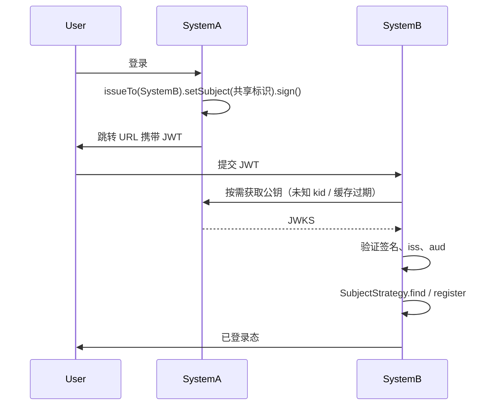

# Trusta Spring Boot Starter

Trusta 是一种去中心化的联邦身份认证方案：签发方必须明确知道签发给谁；接收方主动声明信任哪些签发方，并用策略把 JWT `sub` 匹配到本地用户。

## 功能特点

- JWT（ECDSA + SHA256）签名与验证，header 携带 `kid`
- 签发必须指定 `audience`，无通配符
- 接收方始终校验 `iss` / `aud`，subject 固定为 `sub`
- 按签发方绑定 `SubjectStrategy`（可多 issuer 复用同一 Class）
- 签发方 keyset 轮换；接收方按 `kid` 缓存公钥，未知 `kid` 时再拉取


```mermaid
sequenceDiagram
    participant User
    participant SystemA
    participant SystemB

    User->>SystemA: 登录
    SystemA->>SystemA: issueTo(SystemB).setSubject(共享标识).sign()
    SystemA->>User: 跳转 URL 携带 JWT
    User->>SystemB: 提交 JWT
    SystemB->>SystemA: 按需获取公钥（未知 kid / 缓存过期）
    SystemA-->>SystemB: JWKS
    SystemB->>SystemB: 验证签名、iss、aud
    SystemB->>SystemB: SubjectStrategy.find / register
    SystemB->>User: 已登录态
```

## HowTo

在 `pom.xml` 中添加依赖（注意与 `cc.ddrpa.dorian:trusta-spring-boot-starter:0.0.1` 不再兼容）：

```xml
<dependency>
    <groupId>cc.ddrpa.dorian</groupId>
    <artifactId>trusta-spring-boot-starter</artifactId>
    <version>0.1.0-SNAPSHOT</version>
</dependency>
```

### 配置

```yaml
trusta:
  private-keyset-file: 'trusta-jwt-es256-private-keyset'
  issuer: 'system-a.example.cc'
  allow-http: false
  token-validity: 30   # 签发令牌默认有效期（秒），默认 30，上限 600
  trusted-issuers:
    - issuer: 'system-b.example.cc'
      public-key-uri: 'https://system-b.example.cc/.well-known/trusta-jwks.json'
      identifier: com.example.security.EmailSubjectStrategy
    - issuer: 'system-b-staging.example.cc'
      identifier: com.example.security.EmailSubjectStrategy
    - issuer: 'zzd.example.cc'
      identifier: com.example.security.ZzdSubjectStrategy
```

说明：

- 本系统签发者标识为 `system-a.example.cc`，并暴露 `/.well-known/trusta-jwks.json`
- 未配置 `public-key-uri` 时，默认拉取 `https://${issuer}/.well-known/trusta-jwks.json`
- `identifier` 为 `SubjectStrategy` 实现类；同类签发方可复用同一 Bean
- `token-validity` 为签发令牌默认有效期（秒，默认 30，上限 600）；跨系统跳转令牌应保持短生命周期，单次签发可用 `setValidityPeriod(...)` 覆盖
- 私钥 keyset 文件缺失时会在启动时**自动生成**（owner-only `0600`，原子写入）——首次运行免手工造钥；生产建议由 secret manager / 只读挂载外部供给 keyset
- 密钥轮换/写回通过同目录临时文件 + 原子替换（owner-only `0600`），写失败不会改变运行态（只读挂载下轮换会明确失败）
- 启动时会校验每个 trusted issuer 都有对应的 Spring Bean，否则失败

### 签发

```java
String token = trustaManager.issueTo("system-b.example.cc")
        .setSubject(user.getEmail())
        .sign();
```

签发给不同 audience 时，由调用方写入双方约定的共享标识（邮箱、手机号、浙政钉用户 ID 等）。

令牌默认有效期 30 秒（`trusta.token-validity`，单位秒，默认 30，上限 600），只覆盖一次 A→B 跳转；B 验签后应自建会话，不要把该令牌当作长期凭证使用。

### 接收与用户匹配

```java
@Component
public class EmailSubjectStrategy implements SubjectStrategy<User> {
    @Override
    public Optional<User> find(String subject, VerifiedClaims claims) {
        return userRepository.findByEmail(subject);
    }

    @Override
    public User register(String subject, VerifiedClaims claims) {
        return userService.createFromEmail(subject, claims);
    }
}
```

```java
User user = trustaManager.resolve(token);
```

`resolve`：验签 → 按 `iss` 取策略 → `find`，空则 `register`。不覆盖 `register` 即不支持静默注册。

仅验签：

```java
VerifiedClaims claims = trustaManager.verify(token);
```

额外字段从 `claims.getClaims()` 读取：返回不可变的 `Map<String, String>`，包含验签后 payload 的全部字段（`iss`/`sub`/`aud`/`exp` 等标准 claim 也在内）；字符串原样，数字/布尔/数组/对象为紧凑 JSON 文本。例如 `claims.get("role")`。

### 调用点与入口防护（应用层职责）

starter 只提供验签/解析原语，**在哪些入口处理 JWT 由接收方决定**（例如仅在登录跳转端点调用 `verify`/`resolve`，不要放进通用鉴权过滤器把跳转令牌当长期凭证）。入口层（Servlet Filter / 网关）负责对该入口做**限流与请求长度上限**。

库内另内置了不改变正常路径的安全边界（均定义在令牌/密钥材料层面，与传输方式无关）：

- 接受的**公钥 keyset 内容上限 256 KiB**，超限拒绝解析；
- 密钥缓存未命中（未知/已停用 `kid`，或缓存过期）时刷新公钥，刷新有 **30 秒节流**：连续伪造令牌不会逐次触发刷新；合法轮换一次刷新即命中，手工 `updateIssuerPublicKey()` 不受节流限制；
- 传入的 JWT 长度上限 16 KiB，超限在解析前直接拒绝。

（注：`kid` 属于 JWT 自身第一段的字段，不是 HTTP header。公钥获取由库经 HTTPS 向配置 URI 拉取——这是实现细节，公开 API 只涉及令牌字符串与公钥内容。）

### 密钥轮换

新密钥使用带 `kid` 的 ES256 keyset；只以 primary 签发，公钥集同时发布仍启用的旧钥。

```java
int newKeyId = trustaManager.rotateSigningKey();
// 宽限期后（建议 ≥ token 有效期；签发默认 30 秒，见 trusta.token-validity）
trustaManager.disableNonPrimaryKeys();
// 或禁用指定非 primary 钥
trustaManager.disableSigningKey(oldKeyId);
```

接收方不定期轮询公钥：内存缓存（默认 3 分钟）命中则本地验签；`kid` 未知或缓存过期时再拉 JWKS。也可手动调用 `updateIssuerPublicKey()`。
